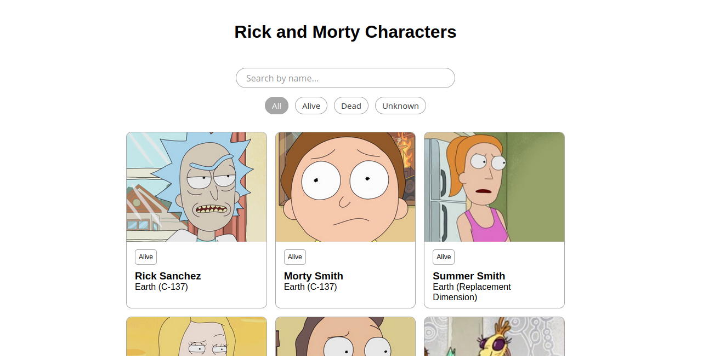

# Mini Project: Filter Rick and Morty Characters

Demo link: <a href="https://project-rickandmorty-demo.netlify.app/" target="_blank">https://project-rickandmorty-demo.netlify.app/</a>

Di project ini user dapat melakukan filter karakter Rick and Morty berdasarkan status karakternya: Alive/Hidup, Dead/Mati atau Unknown/Tidak diketahui statusnya. Filter karakter dilakukan dengan memanipulasi element HTML menggunakan Javascript DOM. 

Konsepnya:
<ul>
    <li> Jika user menekan tombol 'ALIVE' maka yang akan tampil adalah karakter yg masih hidup (alive). </li>
    <li> Jika user menekan tombol 'DEAD' maka yang akan tampil adalah karakter yg sudah mati (dead). </li>
    <li> Jika user menekan tombol 'UNKNOWN' maka yang akan tampil adalah karakter yg tidak diketahui apakah statusnya hidup/mati (unknown). </li>
    <li> Jika user menekan tombol 'ALL' maka yang akan menampilkan semua karakter. </li>
</ul>

